<div align="center">

<a href="https://autoseo.codext.de"></a>

# AutoSEO

### The open-source AI SEO & GEO platform

See how **ChatGPT, Perplexity, Gemini, Claude, Google AI Overviews** and other AI engines talk about your brand, then fix
it, next to a complete SEO suite: keyword research, rank tracking, site audits, backlinks, Search Console, GA4 and
white-label reports. Self-host it for free, or get your own managed instance.

[](LICENSE)
[](https://github.com/codextde/autoseo/stargazers)
[](https://github.com/codextde/autoseo/actions/workflows/ci.yml)
[](https://github.com/codextde/autoseo/pkgs/container/autoseo)
[](https://nextjs.org)

**[Website](https://autoseo.codext.de)** · **[AutoSEO Cloud ($50/mo)](https://autoseo.codext.de/pricing)** ·
**[Self-hosting guide](docs/SELF_HOSTING.md)** · **[Discussions](https://github.com/codextde/autoseo/discussions)**

<br>

<picture>
  <source media="(prefers-color-scheme: dark)" srcset="docs/screenshots/dashboard-dark.png">
  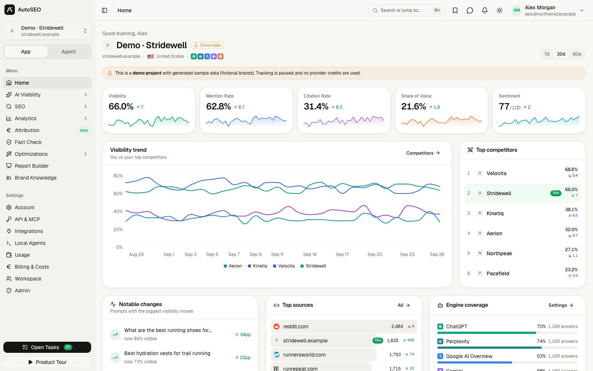
</picture>

</div>

## Why AutoSEO?

Search is moving into AI answers. When someone asks ChatGPT *"what's the best tool for …"*, you either get
recommended or you don't, and classic SEO tools can't tell you which. The AI-visibility tools that can are closed
source, priced per seat and per prompt, and keep your data.

AutoSEO is different:

- **Everything in one place.** AI visibility (GEO/AEO) *and* classic SEO, analytics, attribution, content and
  reporting. No stitching five subscriptions together.
- **Open source and yours.** MIT licensed. Run it on your own server with one command, keep all data, extend it.
- **Uses the AI subscription you already have.** All AI work runs through your local **Claude Code** or **Codex CLI**
  via a lightweight agent, with API keys (Anthropic, OpenAI, OpenRouter, Perplexity, Gemini, …) as a fallback.
- **Built for teams and agencies.** Workspaces, roles and per-project permissions, invite-only magic-link login,
  white-label reports, client access, REST API and an MCP server with 100+ tools.

## Get started

| | Option | Time |
|---|---|---|
| ☁️ | **[AutoSEO Cloud](https://autoseo.codext.de)**: your own private, fully managed instance at `yourname.autoseo.codext.de`. Updates, SSL and email included. **$50/month**, cancel anytime. | 2 min |
| 🐧 | **One-line installer** on any Linux server with a domain: `curl -fsSL https://autoseo.codext.de/install \| bash` | 5 min |
| 🐳 | **Docker Compose** with the prebuilt image `ghcr.io/codextde/autoseo` ([`deploy/`](deploy/)) | 5 min |
| 🚀 | **[Coolify](#deploy-with-coolify)**: Docker Compose build pack pointed at this repository | 5 min |

Every self-hosted option is free and includes every feature. See the **[self-hosting guide](docs/SELF_HOSTING.md)**
for requirements, updates, backups and reverse-proxy setups.

## Feature tour

<table>
  <tr>
    <td width="50%">
      <b>AI visibility tracker</b><br>
      Visibility, mention rate, citation rate and position per prompt across 11 AI engines, with trends, breakdowns,
      prompt flow, locations and query fan-outs.
      <br><br>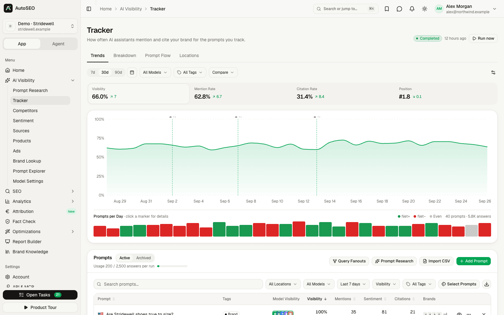
    </td>
    <td width="50%">
      <b>Competitors</b><br>
      Share of voice, mention depth, sentiment and ranking against every brand AI engines mention next to yours.
      <br><br>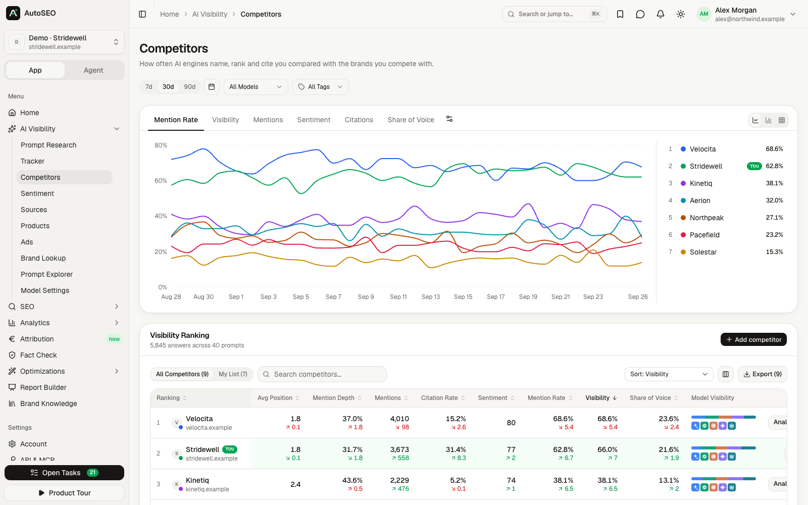
    </td>
  </tr>
  <tr>
    <td>
      <b>Sources &amp; citations</b><br>
      Which pages and domains AI engines cite for your prompts, by content type, and where you need to be listed.
      <br><br>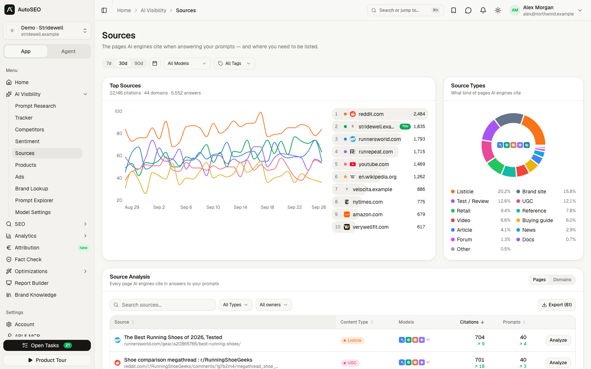
    </td>
    <td>
      <b>Sentiment</b><br>
      What AI praises and criticises about you and your competitors, and whom it recommends.
      <br><br>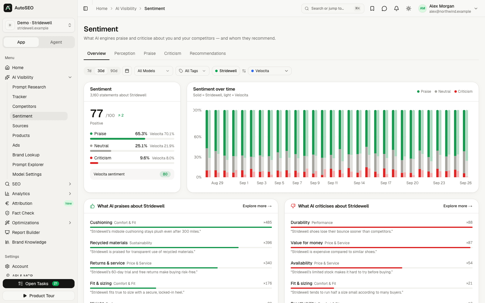
    </td>
  </tr>
  <tr>
    <td>
      <b>Keyword research</b><br>
      Volumes, CPC, difficulty and intent (DataForSEO), saved lists with tags, export to CSV and Google Sheets.
      <br><br>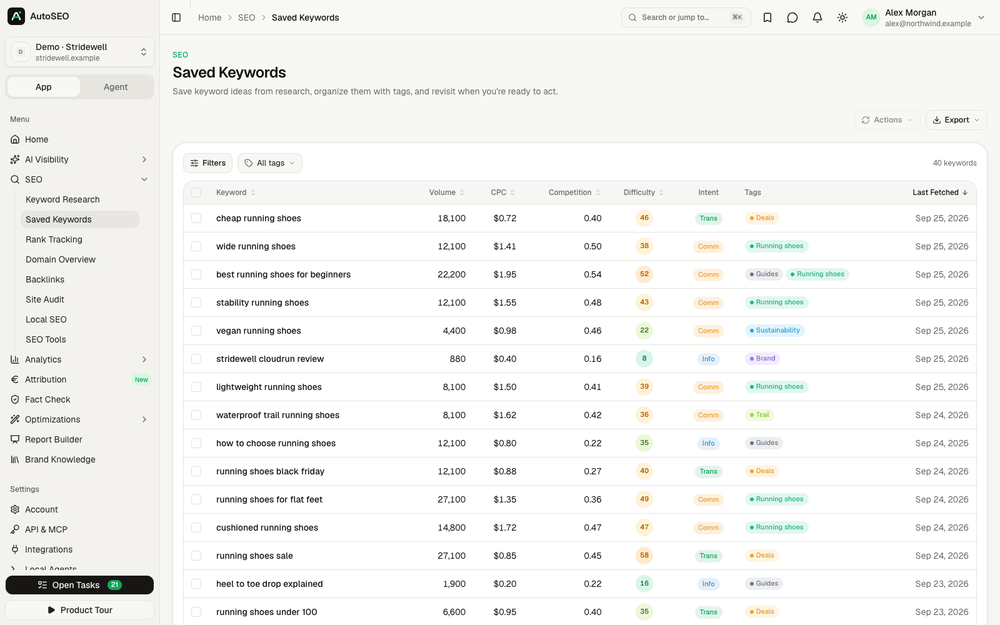
    </td>
    <td>
      <b>Rank tracking</b><br>
      Desktop and mobile positions, position distribution, SERP features and movers for every tracked domain.
      <br><br>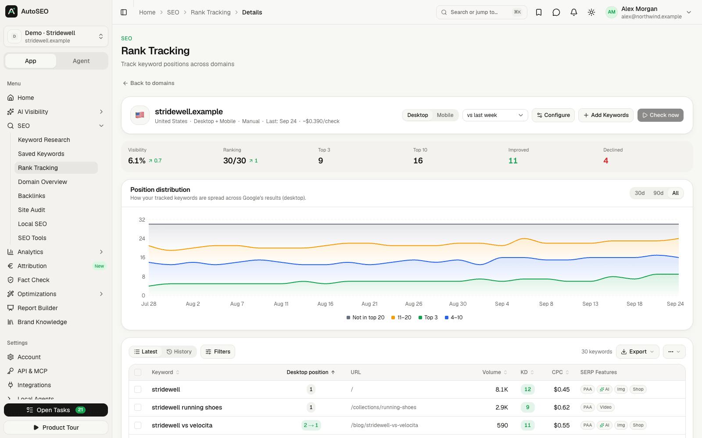
    </td>
  </tr>
  <tr>
    <td>
      <b>Site audit</b><br>
      Built-in crawler with 29 technical checks, Lighthouse, health score history and run comparisons.
      <br><br>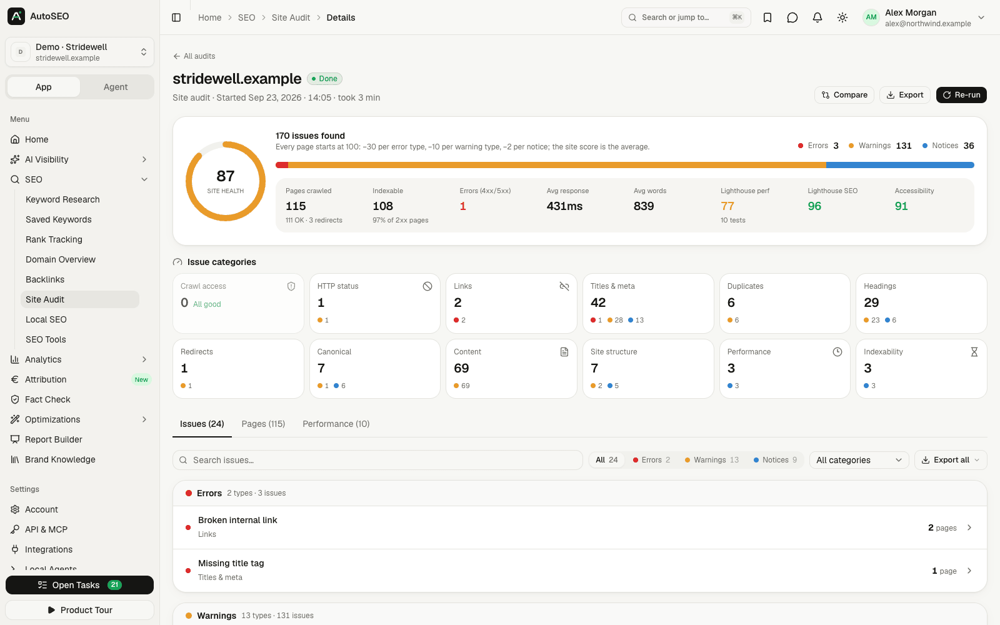
    </td>
    <td>
      <b>Report builder</b><br>
      Drag-and-drop slides with live data, brand kits, PPTX/PDF export and password-protected share links.
      <br><br>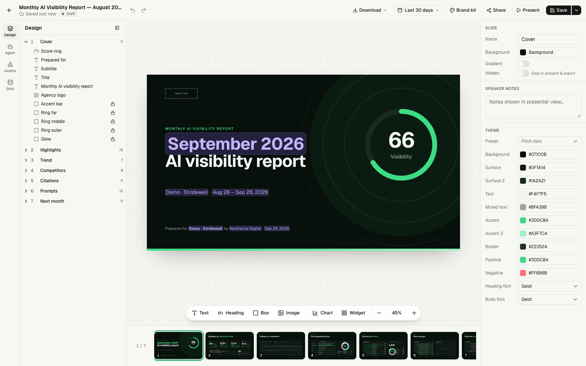
    </td>
  </tr>
  <tr>
    <td>
      <b>AI bot traffic</b><br>
      Which AI crawlers (GPTBot, ClaudeBot, PerplexityBot, Google-Extended, …) read your site, from logs or CDN connectors.
      <br><br>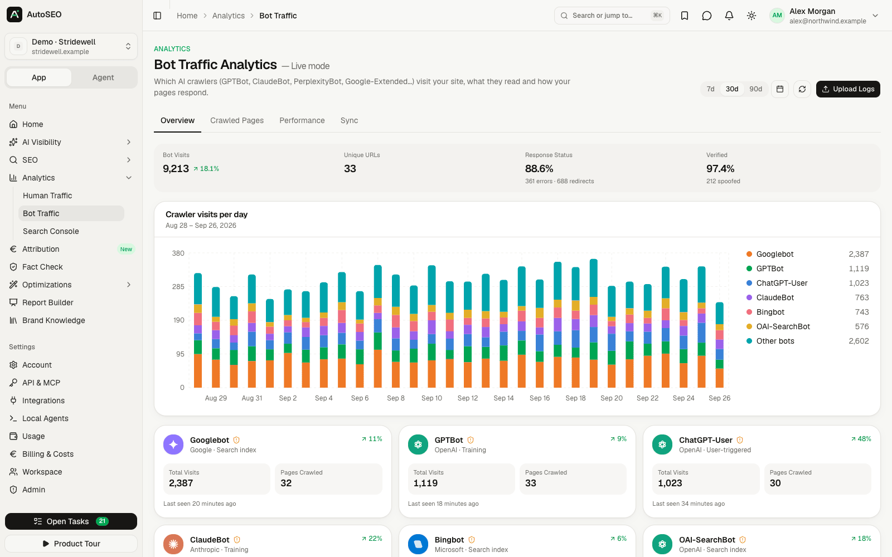
    </td>
    <td>
      <b>Attribution</b><br>
      "How did you hear about us?" meets orders and deals: see how much revenue AI search really drives.
      <br><br>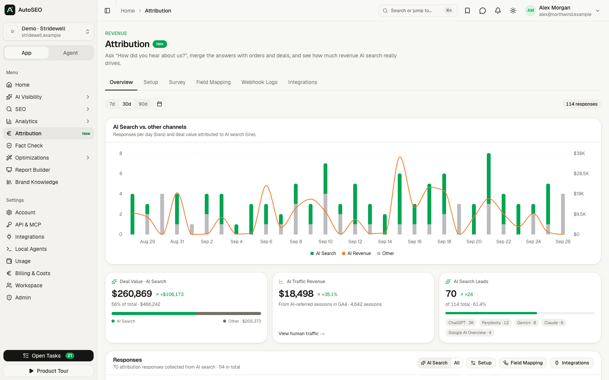
    </td>
  </tr>
  <tr>
    <td>
      <b>Prioritised tasks</b><br>
      Evidence-backed actions generated from all datasets, pushed to Jira, Linear, Asana and more.
      <br><br>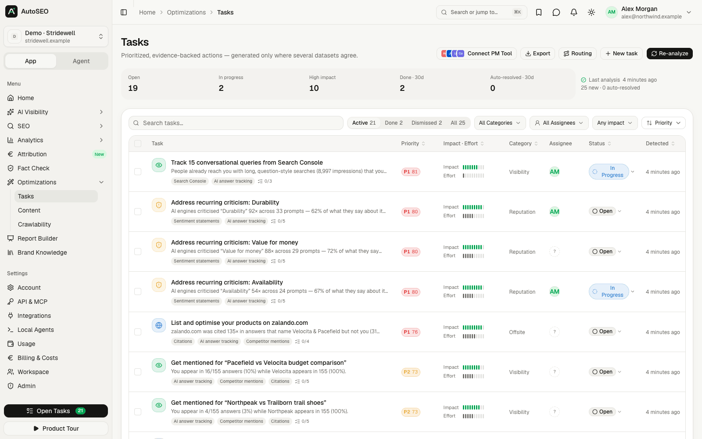
    </td>
    <td>
      <b>Admin, roles &amp; permissions</b><br>
      Everything is configured in the admin panel: users, invitations, roles, email, AI and data providers, limits.
      <br><br>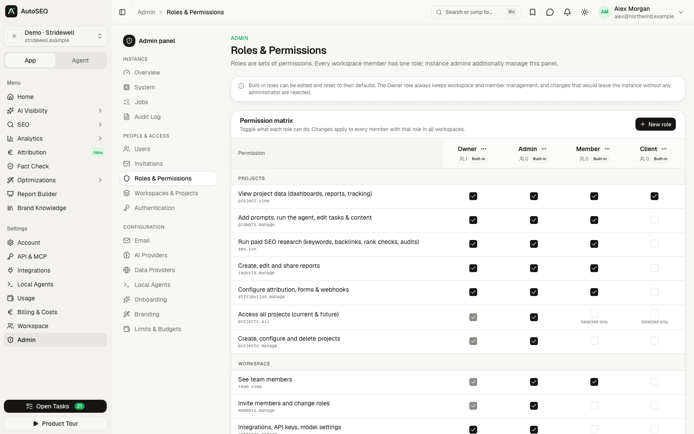
    </td>
  </tr>
  <tr>
    <td>
      <b>Agent mode</b><br>
      Chat with your data through your own Claude Code / Codex (with every AutoSEO tool) or the API fallback.
      <br><br>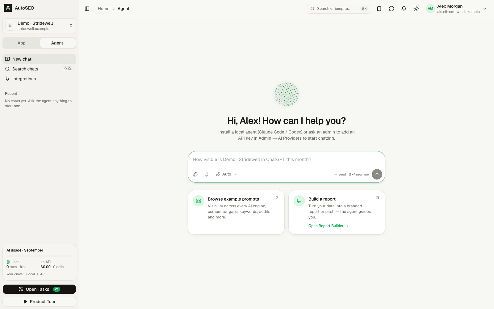
    </td>
    <td align="center">
      <b>Fully mobile optimized</b><br>
      Every page works on a phone, in light and dark mode.
      <br><br>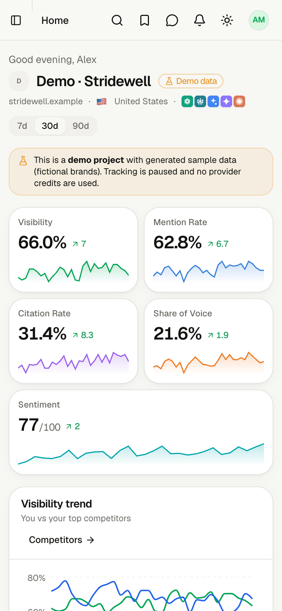
    </td>
  </tr>
</table>

## Everything that's included

| Area | What's inside |
|---|---|
| AI Visibility | Prompt research, tracker (trends, breakdown, prompt flow, locations, query fan-outs), competitors, sentiment, sources, products, ads, brand lookup, prompt explorer, model settings |
| AI engines | ChatGPT (API and app), Perplexity, Gemini, Claude, Google AI Overviews, Google AI Mode, Microsoft Copilot, Grok, Mistral, DeepSeek |
| SEO | Keyword research, saved keywords, rank tracking, domain overview, backlinks, site audit (issues, pages, Lighthouse, compare), local SEO, free SEO tools, export to CSV / Google Sheets |
| Analytics | Human traffic (GA4 & others), bot traffic (log uploads, CDN connectors, server-log webhook), Search Console (performance, opportunities, URL inspection) |
| Attribution | 7-step setup, snippet + webhooks, channel & revenue attribution |
| Optimizations | Tasks (push to Jira/Linear/…), content briefs & drafts (publish to WordPress/Webflow/…), crawlability, fact check |
| Reports | Drag & drop report builder, 11 templates, brand kits, PPTX/PDF export, password-protected share links, AI HTML reports |
| Agent mode | Chat with your data through your own Claude Code / Codex (with every AutoSEO tool) or the API fallback |
| API | REST v1 (OpenAPI), MCP server (100+ tools), OAuth 2.1, API keys with `read` / `write` / `spend` / `export` scopes, 17 agent skills, Claude Code / Codex / Cursor plugins |
| Admin | Users, invitations, roles & permissions, workspaces & projects, authentication, email, AI & data providers, onboarding, branding, limits & budgets, billing & costs, free tools, local agents, jobs, audit log, system health |
| Security | Invite-only magic links + one-time codes, email-domain allow-list, 1-year multi-device sessions, AES-256-GCM encrypted secrets, hashed tokens, SSRF protection, audit log, GDPR export & erasure |

**Stack:** Next.js 16 · React 19 · Tailwind v4 · shadcn/ui · PostgreSQL 17 · Drizzle. One `DOMAIN` variable;
everything else (email via SMTP / Amazon SES, AI providers, DataForSEO, Google OAuth, onboarding, branding, roles,
limits, security) is configured in the **admin panel**.

## AutoSEO Cloud vs. self-hosted

| | Self-hosted | AutoSEO Cloud |
|---|---|---|
| Price | Free forever (MIT) | **$50 / month** per instance |
| Features | All | All |
| Your own isolated instance and database | ✓ (your server) | ✓ (`yourname.autoseo.codext.de`) |
| Users, projects, workspaces | Unlimited | Unlimited |
| Updates, SSL, email delivery | You | Managed for you |
| AI | Your Claude Code / Codex or API keys | Your Claude Code / Codex or API keys |
| Leave any time | n/a | Export your data and move to your own server |

The cloud version is exactly this repository, deployed and operated for you. Buying it funds development of the
open-source project. **[Start at autoseo.codext.de →](https://autoseo.codext.de)**

## Deploy with Coolify

1. Create a new resource → **Docker Compose** → point it at this repository (build pack: Docker Compose,
   file `docker-compose.yml`).
2. Set the domain of the `app` service (e.g. `https://seo.example.com`) and add the environment variable
   `DOMAIN=seo.example.com`. Coolify generates the Postgres password automatically (`SERVICE_PASSWORD_POSTGRES`).
3. Deploy. On first boot the app runs its database migrations and prints a **setup code** to the logs
   (a new code on every restart until setup is done):

   ```
   ╔════════════════════════════════════════╗
   ║  AutoSEO first-run setup               ║
   ║  Open https://seo.example.com/setup    ║
   ║  Setup code: 1234-5678                 ║
   ╚════════════════════════════════════════╝
   ```

4. Open `/setup`, enter the code, name your workspace, create the owner account and (optionally) restrict sign-ins
   to your company domains. You're signed in immediately; configure email delivery next (Admin → Email).

Data lives in two volumes — back up both:

- `autoseo-pg` — PostgreSQL
- `autoseo-data` — uploads, caches, the auto-generated encryption key for stored secrets (`secret.key`) and the
  agent release signing key (`agent-release-key.pem`). Losing `secret.key` makes stored provider credentials
  unreadable; losing the signing key means installed agents stop auto-updating until they are reinstalled.

Updating is a redeploy: migrations run automatically at boot and connected local agents update themselves to the
new build.

Prefer to skip the setup code, e.g. for scripted installs? Set `AUTOSEO_OWNER_EMAIL` (and optionally
`AUTOSEO_SMTP_URL` / `AUTOSEO_MAIL_FROM`); see [optional bootstrap variables](docs/MANAGED_INSTANCES.md).

### Reverse proxy & security settings

- The app trusts `X-Real-IP` / the right-most `X-Forwarded-For` hop set by Coolify's Traefik for rate limits.
  If all traffic comes through **Cloudflare**, enable Admin → Authentication → *Behind Cloudflare* so
  `CF-Connecting-IP` is used (never enable it otherwise — the header could be spoofed).
- Outbound requests to private/LAN addresses are blocked (SSRF protection). Allow specific intranet hosts for
  integrations (e.g. an internal WordPress) under Admin → Authentication → *Internal hosts allowed for integrations*.
- Sessions use `__Host-` cookies (Secure, HttpOnly, SameSite=Lax). Stored secrets are encrypted with AES-256-GCM;
  API keys, OAuth and agent tokens are stored as SHA-256 hashes only.

## Run locally with Docker

```bash
cp .env.example .env          # DOMAIN=localhost:3000
docker compose up --build     # http://localhost:3000 (setup code in `docker compose logs app`)
```

Want to look around first? After setup, click **Explore the demo** on the first onboarding step (or *Explore with
demo data* on any project's home page) to open a demo project with 90 days of generated sample data: fictional
brands, no provider credits used. All screenshots above show that demo project.

## Configuration (admin panel)

| Area | What you configure |
|---|---|
| Authentication | Allowed email domains, invite-only mode, domain self-signup, session length (default 365 days), max devices, magic-link lifetime, Cloudflare, internal hosts |
| Email | SMTP or Amazon SES (region preset), sender, test email |
| AI providers | Prefer local agents, fallback order, Anthropic / OpenAI / OpenRouter / Perplexity / Gemini / xAI / Mistral / DeepSeek keys, per-engine provider mapping |
| Data providers | DataForSEO (keywords, SERPs, backlinks, AI engines), Google OAuth (Search Console, GA4, Sheets), PageSpeed, Bing, Cloudflare |
| Onboarding | Wizard steps, default market/engines/frequency, suggested prompt & competitor counts |
| Branding | App name, logo, colors, docs & demo links |
| Roles & permissions | Owner / Admin / Member / Client + custom roles, per-project access |
| Limits & budgets | Projects, prompts, daily/monthly spend caps, audit size, job concurrency, agency markup |
| Free SEO tools | Publish the free tools at `/free-tools` (off by default), daily budget, rate limits, Turnstile |
| Local agents | Check-in interval, work dir, cleanup, auto-update |

## Local agents (Claude Code / Codex)

Open **Settings → Local Agents → Install agent**, copy the one-liner for macOS/Linux (bash) or Windows (PowerShell)
and run it on a machine that has `claude` and/or `codex` installed:

```bash
curl -fsSL https://seo.example.com/install.sh | AUTOSEO_AGENT_TOKEN=… bash -s -- --host https://seo.example.com
```

- Outbound HTTPS only, no open ports. Starts automatically (launchd / systemd user unit / Scheduled Task).
- Tokens never expire, are stored as SHA-256 only and are shown once. Reinstalling issues a new token.
- Every job runs in a fresh CLI session in its own folder (default: temp dir), jobs run in parallel.
- Updates itself on every deploy (releases are signed; the agent verifies the signature).
- **Lean** mode (default for shared/team work) runs the CLI without your personal settings, MCP servers or shell.
  **Full** mode (your own MCP servers, web fetch) only ever runs for jobs *you* started, and only if you allowed it
  locally with `--allow-full`. Other flags: `--runtime claude|codex`, `--workdir`, `--max-parallel`,
  `--mcp-servers`, `--allow-codex-shell`, `--allow-remote-workdir`, `--no-auto-update`, `--no-autostart`,
  `--uninstall`.

## API, MCP & agent plugins

- REST: `https://seo.example.com/api/v1` (OpenAPI at `/api/v1/openapi.json`, docs under Settings → API & MCP)
- MCP (streamable HTTP): `https://seo.example.com/api/mcp` — OAuth 2.1 or API key
- Claude Code plugin marketplace: `/plugin marketplace add https://seo.example.com/api/plugin/marketplace.json`
  (bundles for Codex and Cursor and a skills zip are under Settings → API & MCP → Skills)

## Development

```bash
docker run -d --name autoseo-pg -e POSTGRES_USER=autoseo -e POSTGRES_PASSWORD=autoseo -e POSTGRES_DB=autoseo \
  -p 54329:5432 postgres:17-alpine
pnpm install
pnpm db:push      # sync schema to the dev database
pnpm dev          # http://localhost:3000
pnpm typecheck && pnpm lint && pnpm test
pnpm db:generate  # create a SQL migration after schema changes (applied automatically in production)
```

See [`docs/ARCHITECTURE.md`](docs/ARCHITECTURE.md) for the code layout and conventions. The website, signup and
billing for AutoSEO Cloud live in [`cloud/`](cloud/) (a separate Next.js app).

## Contributing

Contributions of all sizes are welcome: bug reports, new AI engines, integrations, translations, docs. Read
[CONTRIBUTING.md](CONTRIBUTING.md), open an issue or start a thread in
[Discussions](https://github.com/codextde/autoseo/discussions). Please report security issues privately as described
in [SECURITY.md](SECURITY.md).

If AutoSEO is useful to you, **a ⭐ on GitHub helps a lot**. It's how other people find the project.

[](https://star-history.com/#codextde/autoseo&Date)

## License

[MIT](LICENSE) © Codext GmbH and AutoSEO contributors. Parts of the SEO feature set and agent skills are adapted
from [open-seo](https://github.com/every-app/open-seo) (MIT) — see `plugins/autoseo/NOTICE.md`.
